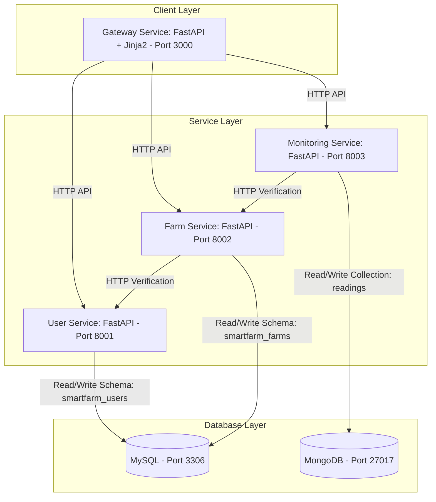

# SmartFarm: End-to-End Microservices Demo Application

SmartFarm is a learning-focused, fully containerized **Smart Agriculture Management System** built with a microservices architecture using **FastAPI, Docker, Docker Compose, MySQL, MongoDB, and Jinja2 server-rendered templates**.

This repository demonstrates how to architect, develop, connect, containerize, and test independent services that function together as a unified application — with a real multi-page web UI instead of a single-page JavaScript app.

---

## 1. System Architecture

The flow is: **Browser → Gateway (FastAPI + Jinja2 templates) → Microservices (HTTP APIs) → Databases (MySQL & MongoDB)**.



Key change vs. a classic static frontend: the browser only ever talks to the **Gateway Service** on port 3000. The gateway renders pages with **FastAPI + Jinja2 templates** and composes data by calling the three domain services over HTTP — the same boundary the services themselves use. This is a **BFF (Backend-for-Frontend)** style pattern.

---

## 2. Technologies Used

* **Python & FastAPI**: For building high-performance, asynchronous REST APIs and the server-rendered gateway.
* **Jinja2 Templates**: Server-side HTML rendering for a multi-page UI (no SPA, no heavy frontend framework).
* **SQLAlchemy**: ORM used to manage MySQL database transactions.
* **MySQL**: Relational database for structured profile data (Farmers, Farms, Crops).
* **MongoDB**: Document-oriented NoSQL database for flexible, high-frequency sensor readings.
* **Docker & Docker Compose**: Containerization, isolated environments, service networking, one-command orchestration.
* **HTML5 / CSS3 + progressive-enhancement JavaScript**: Pages work without JavaScript; a small AJAX request refreshes the live monitoring panel.
* **Pytest**: Testing framework used to run isolated, mocked endpoint tests for every service.

---

## 3. The Multi-Page UI (Gateway Service)

Every domain service gets its own set of pages (2–4 each), plus a "Command Center" that aggregates everything.

| Page | Route | Service backing it |
|---|---|---|
| Command Center (dashboard) | `/` | all three |
| Farmer Registry (list) | `/farmers` | user-service |
| Register Farmer (form) | `/farmers/new` | user-service |
| Farmer Profile (detail + owned farms) | `/farmers/{id}` | user-service + farm-service |
| Farm & Crop Registry (list) | `/farms` | farm-service |
| Create Farm (form) | `/farms/new` | farm-service |
| Farm Workspace (detail + crop table) | `/farms/{id}` | farm-service + user-service |
| Add Crop (form) | `/farms/{id}/crops/new` | farm-service |
| Field Monitoring (live panel) | `/monitoring?farm_id=N` | monitoring-service |
| Reading History | `/monitoring/history` | monitoring-service |
| Record Sensor Reading (form) | `/monitoring/readings/new` | monitoring-service |

**AJAX usage:** the monitoring page renders fully on the server, but the live panel also refreshes through `GET /ajax/monitoring/{farm_id}` when the farm dropdown changes. All forms are plain HTML POSTs with PRG (Post/Redirect/Get) — no JavaScript required for core workflows.

---

## 4. Core Architectural Concepts Demonstrated

### A. Why Microservices?
A monolithic architecture packages the entire application as a single codebase and deployment unit. SmartFarm splits the system into independent services based on business domain boundaries:
1. **User Service**: Manages farmer profiles.
2. **Farm Service**: Manages land assets and crops.
3. **Monitoring Service**: Ingests sensor telemetry.

Each service can be scaled, deployed, and even written in different languages independently.

### B. Relational (MySQL) vs. NoSQL (MongoDB)
* **MySQL** stores Farmers, Farms, and Crops — relational tables are ideal for business definitions with strict constraints (unique emails, linked crops).
* **MongoDB** stores Sensor Readings — sensor nodes generate fast, flexible JSON-like telemetry. Different sensors may report different attributes (moisture, temperature, battery, signal…), which a schema-less document model handles without migrations.

### C. Database Ownership: Shared Infrastructure vs. Shared Database
Directly sharing tables between services creates tight coupling and breaks independent deployment. SmartFarm enforces **Database-per-Service**:
* **Shared infrastructure**: one MySQL container for the whole sandbox.
* **Isolated ownership**: User Service *only* connects to `smartfarm_users`; Farm Service *only* connects to `smartfarm_farms`. Neither can read the other's tables. Cross-boundary data flows only through HTTP APIs.

### D. Service-to-Service Communication
* Creating a farm → Farm Service calls `GET /farmers/{farmer_id}` on User Service. A `404` rejects the farm creation.
* Posting a reading → Monitoring Service calls `GET /farms/{farm_id}` on Farm Service. A `404` rejects the reading.
* The **Gateway** uses the exact same HTTP pattern to compose pages.

---

## 5. Docker & Containerization Explained

* **Dockerfile**: A recipe script to build a container image (base image, packages, source, command).
* **Image**: A read-only snapshot containing the application code and runtime.
* **Container**: A running, isolated instance of an image.
* **Volume**: Persistent storage mounted from the host so MySQL/MongoDB data survives container restarts.
* **Network**: A private bridge network (`smartfarm_net`) lets containers resolve each other by name (e.g. `http://user-service:8001`) instead of hard-coded IPs.
* **Docker Compose**: Defines and runs the whole multi-container application via one file (`docker-compose.yaml`), including health checks, dependency ordering, env vars, and volumes.

---

## 6. Crucial Docker CLI Commands

| Action | Command | Description |
|---|---|---|
| **Build Images** | `docker compose build` | Builds all service images. |
| **Start Sandbox** | `docker compose up -d` | Starts all services in the background. |
| **Start & Rebuild** | `docker compose up --build` | Rebuilds and starts everything (foreground). |
| **Stop Sandbox** | `docker compose down` | Stops and removes containers, network, and resources. |
| **List Containers** | `docker ps -a` | Shows status of all containers. |
| **View Logs** | `docker compose logs -f [service]` | Follows logs for the whole app or one service. |
| **Execute Command** | `docker exec -it smartfarm_mysql mysql -u root -proot@123` | Opens a client shell inside a container. |
| **Clean Volumes** | `docker volume prune` | Deletes unused persistent volumes. |
| **List Images** | `docker images` | Lists built/pulled images. |

---

## 7. Accessing the Application

Once running:

* **Web UI (Gateway)**: [http://localhost:3000](http://localhost:3000)
* **User Service OpenAPI Docs**: [http://localhost:8001/docs](http://localhost:8001/docs)
* **Farm Service OpenAPI Docs**: [http://localhost:8002/docs](http://localhost:8002/docs)
* **Monitoring Service OpenAPI Docs**: [http://localhost:8003/docs](http://localhost:8003/docs)
* **Gateway Health (aggregates all services)**: [http://localhost:3000/health](http://localhost:3000/health)
* **MySQL Server**: `localhost:3306` (Credentials: `root` / `root@123`)
* **MongoDB Server**: `localhost:27017`

---

## 8. Project Structure

```text
smartfarm/
├── docker-compose.yaml          # Orchestrates all 6 containers
├── .env / .env.example          # Configuration (never commit .env)
├── init-db/init.sql             # Creates isolated MySQL schemas on first boot
├── gateway-service/             # NEW: browser-facing FastAPI app
│   ├── Dockerfile
│   ├── requirements.txt
│   ├── app/
│   │   ├── main.py              # All page routes + form handling (PRG)
│   │   ├── client.py            # Tiny HTTP client for service calls
│   │   └── config.py            # Upstream service URLs
│   ├── templates/               # Jinja2 pages (base, dashboard, farmers/,
│   │   │                        # farms/, monitoring/, errors/)
│   ├── static/                  # CSS + one progressive-enhancement JS file
│   └── tests/test_main.py       # Mocked gateway tests
├── user-service/                # Farmer profiles (MySQL: smartfarm_users)
├── farm-service/                # Farms & crops (MySQL: smartfarm_farms)
├── monitoring-service/          # Sensor readings (MongoDB)
└── docs/                        # learning-guide.md, demo-scenario.md
```

---

## 9. Next Steps

1. **[docs/learning-guide.md](docs/learning-guide.md)**: Step-by-step tutorial from local development to Docker Compose.
2. **[docs/demo-scenario.md](docs/demo-scenario.md)**: A demo script showing microservices boundaries, service-to-service calls, and fault tolerance.

> Note for GitHub Actions: the repository is designed to be deployed by building the images in `docker-compose.yaml` (or `docker compose build` per service) and running them on any host. Health checks on each service make container-orchestrator readiness simple to wire up.
